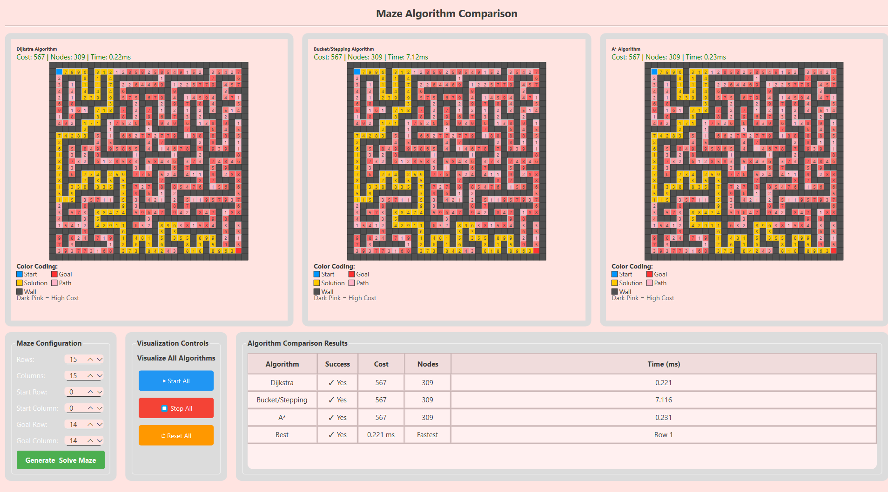

---

# 🧩 Maze Algorithm Comparison Tool

[](https://isocpp.org/)
[](https://www.qt.io/)
[](https://cmake.org/)

A comprehensive C++/Qt application for visualizing and comparing different pathfinding algorithms on weighted mazes. This tool provides an interactive environment to observe how Dijkstra's, A*, and Bucket-based algorithms navigate complex grids with varying costs.

## 🖼️ Application Gallery

### Core Interface
The application features a three-panel layout showing all algorithms side-by-side for immediate visual comparison.
<p align="center">
  
</p>

---

## 🌟 Key Features

- **Interactive Maze Generation**: Dynamically create random mazes with customizable dimensions (5x5 to 50x50).
- **Multiple Optimized Algorithms**:
  - **Dijkstra's Algorithm**: Guarantees the shortest path using a min-heap priority queue.
  - **A* Search**: Heuristic-guided pathfinding using Manhattan distance for superior efficiency.
  - **Bucket/Stepping Algorithm**: Utilizes a bucket-based priority system for $O(1)$ operations in bounded integer ranges.
- **Real-time Visualization**: Watch algorithms solve the maze step-by-step with adjustable controls.
- **Performance Analytics**: Detailed metrics including path cost, node expansion count, and execution time in milliseconds.
- **Weighted Terrain**: Every cell contains a random weight (1-9), demonstrating algorithm behavior in non-uniform cost environments.

---

## 🏗️ System Architecture

The project follows a modular design, separating core algorithms and data structures from the graphical presentation.

| Layer | Responsibility |
| :--- | :--- |
| **Logic & Algorithms** | Implementation of pathfinding logic and graph traversal. |
| **Custom Containers** | Manual implementation of fundamental data structures (`MyVector`, `MyPriorityQueue`)[cite: 1]. |
| **UI Components** | Qt-based widgets for grid rendering and user controls. |

### 📁 Project Structure
```text
MAZEFINALLL/
├── src/
│   ├── Maze.cpp            # Maze logic and core data structures[cite: 1]
│   ├── MazeAlgorithms.cpp  # Dijkstra, A*, and Bucket implementations[cite: 1]
│   ├── MazeWidget.cpp      # Individual grid rendering[cite: 1]
│   └── MazeSolverWidget.cpp# Main application window logic[cite: 1]
├── include/                # Header files (.h) and templates (.tpp)[cite: 1]
└── CMakeLists.txt          # Build system configuration[cite: 1]
```

---

## 🚀 Getting Started

### Prerequisites
*   **C++17** compiler
*   **Qt6** (Widgets module)
*   **CMake 3.16** or later

### Build Instructions
```bash
# Clone the repository
git clone https://github.com/Jana/maze-algorithm-comparison.git
cd maze-algorithm-comparison

# Create build directory
mkdir build && cd build

# Configure and build
cmake ..
cmake --build . --config Release
```

---

## 🛠️ Technical Implementation

### Custom Data Structures
To demonstrate a deep understanding of memory management and algorithm complexity, this project implements custom container classes from scratch instead of relying on the STL:
*   **`MyVector<T>`**: A dynamic array with automatic resizing and bounds checking[cite: 1].
*   **`MyPriorityQueue<T>`**: A binary min-heap implementation for efficient node selection in Dijkstra and A*[cite: 1].

### Visualization Legend
*   🔵 **Blue**: Start Position
*   🔴 **Red**: Goal Position
*   ⬜ **Gray**: Obstacles/Walls
*   🟡 **Yellow**: Final Optimal Path
*   🌸 **Pink Shades**: Explored Nodes (Darker = Higher Cost)

---

## 📊 Performance Comparison

Typical performance characteristics on a 15x15 maze:

| Algorithm | Path Cost | Nodes Expanded | Time (ms) |
| :--- | :--- | :--- | :--- |
| **Dijkstra** | Optimal | Most | Fast |
| **A\*** | Optimal | Fewest | Very Fast |
| **Bucket** | Optimal | Similar to Dijkstra | Moderate |

---
